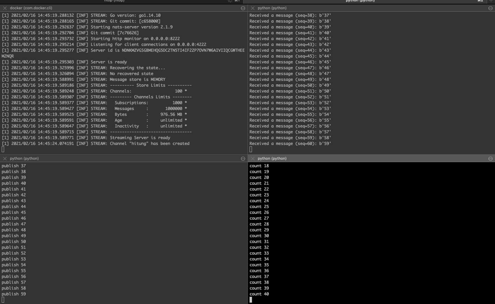
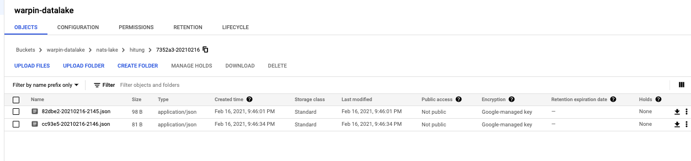

## Demo

- add env first

		export GOOGLE_APPLICATION_CREDENTIALS="/{PATH}/gcp-service-account.json"

- edit at `file_mover.py` based on your gcs bucket

```python
os.environ["GCS_PATH"] = "warpin-datalake"
os.environ["GCS_SUBPATH"] = "nats-lake"
```

### If you don't have docker engine installed on your local machine

- https://docs.docker.com/get-docker/

### Run nats cluster in docker

	docker run -p 4222:4222 -p 8222:8222 -p 6222:6222 -p 4223:4223 nats-streaming:latest

### Run script orderly

1.
		python pubs_stream.py

2.
		python nats-subscribe.py

3.
		python file_mover.py


### Check gcs storage

- {warpin-datalake/nats-lake/hitung} according to your gcs bucket

### Output

<center></center>

-
<center></center>

## Demo Protocol Buffers

To create and read file `records.bin`, Run the following commands:
1. `python proto_write.py`
2. `python proto_read.py`

To publish and consume protocol buffers messages in NATS Streaming server, make sure the NATS Streaming server has run. Then run the following commands in separate terminal windows.
1. `python publisher.py`
2. `python subscriber.py`
